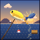

# FishMania



**FishMania** is a fishing expansion mod for [tModLoader](https://tmodloader.net) (Terraria 1.4.4.9) that turns fishing into a full progression path.

**Author:** [trentinidev](https://github.com/trentinidev)

## Content by version

### v1.0
- **38 new fish** across every biome (forest, ocean, desert, snow, jungle, corruption, crimson, hallow, glowing mushroom, sky, caverns, lava and honey), including secret legendary fish announced by sonar
- **8 fishing rods**, from the Bamboo Rod up to the Supreme Angler's Rod (lava fishing!)
- **6 baits**, including lava bait and the Void Bait
- **7 fishing accessories**, culminating in the Legendary Angler's Gear (combines them all)
- The **Legendary Angler vanity set**, a **pet goldfish**, fish dishes (sushi, moqueca, banquet) and the Supreme Angler Potion
- Catch system based on biome, rarity and depth

### v1.1
- All sprites redrawn in **Terraria's visual style**: diagonal pose, hue-shifted cel shading and selout outlines
- Improved fish anatomy: forked tails, gills, fin rays and back highlights

### v1.2
- Bigger fish and rod sprites; fishing line removed from rod sprites
- Baits, accessories, pet bowl and foods redrawn with much more detail
- New mod icon with a full scene: sun rays, clouds, water reflections and a leaping golden fish

### v1.3
- Fish redesigned with **tall, full bodies matching vanilla fish size and proportions**
- Rods reshaped into vanilla-style arcs with segment rings, wrapped leather grip and pommel

### v1.3.1
- Fish now face the **upper-right diagonal**, exactly like vanilla fish, recalibrated against the game's original sprites
- Scale dithering on every fish; rod curvature softened

### v1.4.0
- Mod renamed to **FishMania** and fully translated to English
- The vanity set became the **Fisherman armor set**: 20/24/22 defense, +10 fishing power per piece, and a full-set bonus granting permanent Fishing, Sonar and Crate potion effects

### v2.0.0 — The Great Expansion
- **62 new fish (100 total!)**, including blood moon, rain and night-only catches, plus new legendary fish (Leviathan Fry, Midas Fish, Void Maw, Clockwork Pike...)
- **12 new rods (20 total)** with matching bobbers, from the humble Cactus Rod to the Shroomite Rod
- **9 new baits (15 total)**, topped by the mighty Starworm
- **3 new accessories (10 total)**: Lucky Lure, Crate Magnet and Lavaproof Tackle Bag
- **2 new armor sets** — Apprentice Fisher (early game) and Abyssal Diver (endgame) — and **3 vanity sets**: Sailor, Brass Diver and Fish Costume
- **6 biome fishing crates** with custom loot: Mushroom/Mycelium, Cavern/Deepstone and Honey/Royal Jelly
- **2 new pets** (Puffer Pal and Axolotl Pal), 4 new dishes and 2 new potions (including the Depths Elixir — temporary lava fishing)
- Brand-new sunset cover art

### v2.0.1
- Biome crates no longer replace lava crates when lava fishing, and honey crates take priority over mushroom crates
- Sparkling Cricket and Frost Fly recipes no longer downgrade bait power (Worm instead of Firefly)
- Crate Magnet rarity corrected to Light Red; localization normalized to tModLoader's canonical format

## Building

The mod is built with tModLoader's own toolchain:

```
dotnet tModLoader.dll -build <path-to-this-folder>
```

Or place the folder in `Documents/My Games/Terraria/tModLoader/ModSources` and use **Workshop → Develop Mods → Build + Reload** in game.

All sprites are generated procedurally (pixel-art generator with cel shading, selout outlines and vanilla-calibrated proportions). Armor equip sheets are derived from [tModLoader's ExampleMod](https://github.com/tModLoader/tModLoader) (MIT).

## Changelog

See [description.txt](description.txt) for the full version history.
